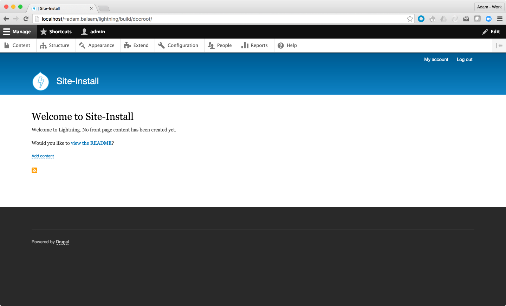
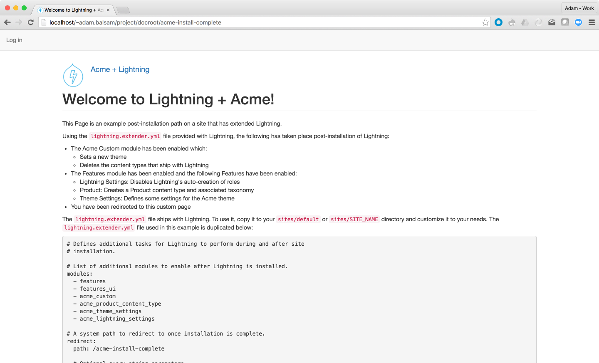

# Acme Lightning Extend

This is an example project that extends the Lightning Distribution of Drupal. It gives users a different out-of-the-box experience than Lightning normally would, with additional code and configuration. It makes use of the [Lightning Extend feature](https://www.drupal.org/node/2734507#comment-11298551) by defining additional dependencies in a `lightning.extend.yml` file:

```
# Defines additional tasks for Lightning to perform after initial profile
# installation.

# List of additional modules to enable after Lightning is installed.
modules:
  - features
  - acme_custom
  - acme_product_content_type
  - acme_theme_settings
  - acme_lightning_settings

# A system path to redirect to once installation is complete.
redirect:
  path: /acme-install-complete

  # Optional query string parameters.
  query: { }

```

## Why?

This functionality is useful for developers who want all the benefits of Lightning but need additional out-of-the-box code, configuration, and user experience.

## Details

### What it does post-installation

This implementation of Lightning Extend does the following:

* Enables the Acme Custom module, which:
  * Sets a new theme
  * Deletes the content types that ship with Lightning
* Enables the Features module and activates the following Features:
  * Lightning Settings: _Disables Lightning's auto-creation of roles_
  * Product: _Creates a Product content type and associated taxonomy_
  * Theme Settings: _Defines some settings for the Acme theme_
* Redirects the user to a custom messaging page

### How it's built

To build this example, we:

* Started with the [`acquia/lightning-project` template](https://github.com/acquia/lightning-project)
* Added some composer dependencies
* Created a custom module that provides some simple configuration
* Exported additional configuration as Feature modules
* Copied the Lightning-provided `lightning.extend.yml` file to sites/default
* Enabled our additional extensions and provided a redirect path via that file


## Result

On the left is what the user is presented with after installing "Vanilla" Lightning. On the right is what a user would see after installing a version of Lightning that has been "Extended" by Acme. (Customizations are not limited to the presentation layer, it's just the easiest to demonstrate. For example, Acme Lightning Extend also provides a Node Bundle and overrides some Lightning settings.)

| Vanilla Lightning OOTB                                     | Acme Extended Lightning OOTB                                              |
|------------------------------------------------------------|---------------------------------------------------------------------------|
|  |  |

The following animation shows the installation process of Lightning, when extended by Acme, as seen by the Site Builder.


## Instructions

This project is meant as an example, but if you want to try it out:

* Clone this repo
* From VCS root, run `composer install`
* Modify docroot/sites/default/settings.php to match your database settings
* Point your browser to install.php within docroot/core. _(You can also use drush to install the site, but a large part of this functionality is for users who don't have CLI access)_

